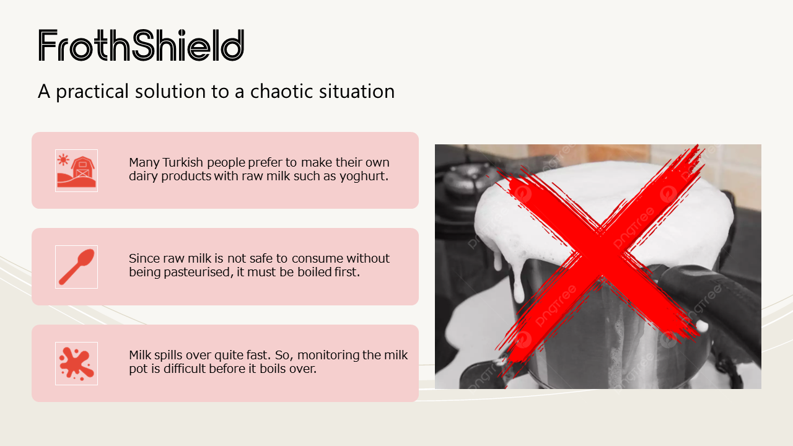
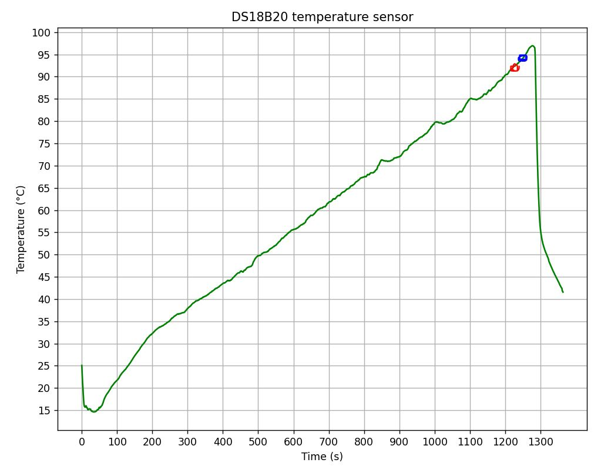
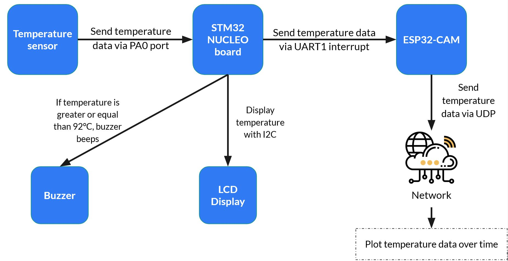
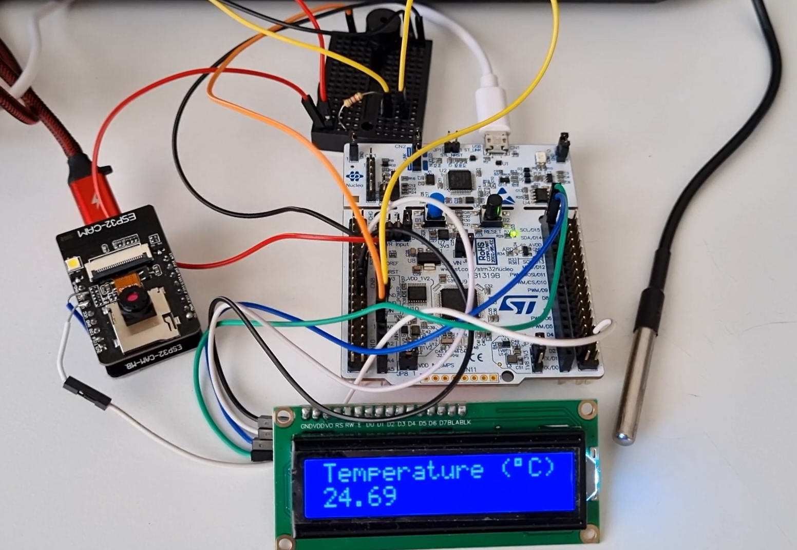
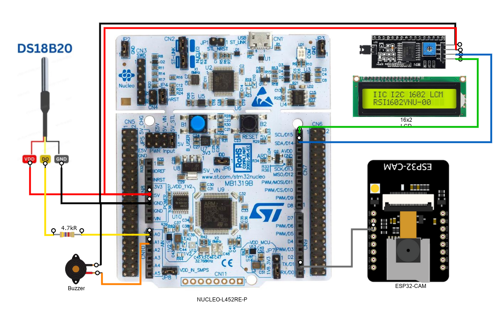

# FrothShield

A wireless temperature reading project with STM32L4 NUCLEO board that prevents milk spilling over before it's too late

## Temperature Plot

## Components Used  

- STM32 NUCLEO-L452RE-P development board
- DS18B20 temperature sensor
- 4.7kΩ resistor
- 16x2 LCD display module with PCF8574 I2C adapter
- ESP32-CAM development board
- Buzzer

## Design Flow

## Project Overview

## Wiring

## References

- darkquesh. “Darkquesh/STM32-DS18B20: C Library for Interfacing the DS18B20 Temperature Sensor with a STM32 like the STM32L452.” GitHub, <https://github.com/darkquesh/STM32-DS18B20>. Accessed 8 Jan. 2024.
- Hasan, Mahamudul. “Interfacing STM32 with I2C LCD : Hal Example Code Included.” Embedded There, 17 Oct. 2023, <https://embeddedthere.com/interfacing-stm32-with-i2c-lcd-with-hal-code-example/>.
- Yourself, Tech It. “Demo 19: How to Use UDP/IP with Arduino ESP32.” IoT Sharing, Blogger, 10 Dec. 2021, <http://iotsharing.com/2017/06/how-to-use-udpip-with-arduino-esp32.html>.
